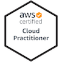
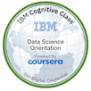

- 🔭 I’m currently working on ...
[Steam BI](https://github.com/m-e-w/steam_bi)

- 🌱 I’m currently learning ...
  - Python
  - SQL
  - PowerBI
- 👯 I’m looking to collaborate on ...
- 🤔 I’m looking for help with ...
- 💬 Ask me about ...
- 📫 How to reach me: ...
- 😄 Pronouns: ...
- ⚡ Fun fact: ...

# Certifications
## AWS

# Courses
## IBM

<!--
Hi there 👋
**m-e-w/m-e-w** is a ✨ _special_ ✨ repository because its `README.md` (this file) appears on your GitHub profile.

Here are some ideas to get you started:

- 🔭 I’m currently working on ...
[Steam BI](https://github.com/m-e-w/steam_bi)

- 🌱 I’m currently learning ...
  - Python
  - SQL
  - PowerBI
- 👯 I’m looking to collaborate on ...
- 🤔 I’m looking for help with ...
- 💬 Ask me about ...
- 📫 How to reach me: ...
- 😄 Pronouns: ...
- ⚡ Fun fact: ...
-->
